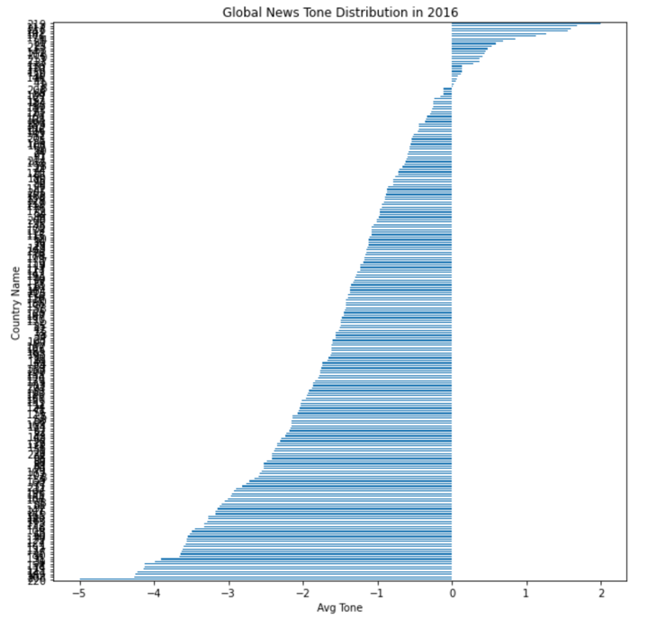
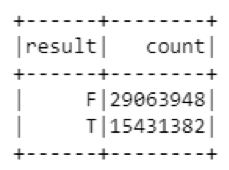

# Global News Analysis in 2016
* Team: Hoyas No1
* Team Member: Beixuan Jia, Xin Lu, Miao Wang, Minyuan Xu

## Executive Summary

For many of us, the major source of information about world events is the news media. Undeniably, media coverage of topics influences the perceived importance of many topics. However, the news conveys not only facts but also biases via article sentiment and word selection, becoming instrumental in individual attitude formation. In other words, the media influence what we think about and how (Boudemagh and Moise 2016). Since the news media are dominated by global news agencies such as CNN, BBC and Reuters, it makes us wonder if the world really is what those global news agencies describe? Our question leads us to finding and analyzing the Global Database of Events, Language, and Tone (GDELT) project, which is a real time database of global human society that monitors the world's broadcast, print, and web news since 1979. The goal of this project is to understand if the opinion of the local news agencies differ from the global news agencies by analysing controversial public figures or countries, and better understand the global world in 2016 by predicting the tone of each event reported. 

## 1. Introduction

The Global Data on Events, Location and Tone (GDELT) provides one of the best opportunities to perform Big Data analytics on news and events . GDELT stores 2 major databases, GDELT Event Database and GDELT Global Knowledge Graph (GKG). We chose to analyze news archived in 2016 from the GDELT 2.0 Event Database, which has 58 features and over 73 million rows. We focused our analysis mainly on news in the US and China, because as Chinese international students studying in the US, we are fairly familiar with major US and Chinese events, and we could compare the machine learning (such as building of logistic regression) results with our common knowledge. We also identified and characterized events and countries that generated an extensive media coverage and also extreme sentiment in the news reports, perform exploratory analysis on selected controversial public figures and selected countries (i.e. US and China), then created clusters to identify any obvious groups of tones that can be used to assist classification model building which predicts the tone of every event. 

## 2. Methods
### 2.1 Dataset & Data Preparation

The dataset used for this project is the news archived in 2016 from the GDELT 2.0 Event Database, which has 58 features and 73,385,698 records. Out of the 58 features, 50 features are qualitative variables and 7 are quantitative variables, and 1 is the target variable AvgTone, which is a score indicating the tone of the event. Key columns and descriptions are described as follow: 

* AvgTone. (numeric) This is the average “tone” of all documents containing one or more mentions of this event during the 15 minute update in which it was first seen. The score ranges from -100 (extremely negative) to +100 (extremely positive).

* GoldsteinScale. (floating point) Each CAMEO event code is assigned a numeric score from -10 to +10, capturing the theoretical potential impact that type of event will have on the stability of a country. 

* NumMentions. (integer) This is the total number of mentions of this event across all source documents during the 15 minute update in which it was first seen.

* NumSources. (integer) This is the total number of information sources containing one or more mentions of this event during the 15 minute update in which it was first seen.

* QuadClass. (integer) The entire CAMEO event taxonomy is ultimately organized under four primary classifications: 1=Verbal Cooperation, 2=Material Cooperation, 3=Verbal Conflict, and 4=Material Conflict.

* EventRootCode. (string) CAMEO event codes which defines the root-level category the event code falls under.

Since the size of the data is over 20GB, which is impossible to process on a single personal computer, we decided to store the data on Amazon S3 and use PySpark to analyze the data on Amazon Elastic MapReduce (EMR) Cluster. 

The 2016 events from the GDELT 2.0 Event Database is stored on Amazon S3 ("s3://gdelt-open-data/events/2016*"). Since the column titles are stored in a different location, so first I needed to combine the data and columns together. Then I checked for incorrect data types, and converted the data type into the correct ones. Next when checking for missing data, some columns turned out to have many missing values, such as columns related to Actor1, one of the subjects in the event. Considering another subject, Actor2’s information is still available and can be crucial to analysis, I decided not to remove any columns with missing values related to Actor1. Next I checked for outliers or any incorrect data values of both qualitative data and quantitative data, and did not find any. In general, the data are very clean.

After the data cleansing and initial data exploration are finished, the cleased dataset is stored on our own Amazon S3 bucket ("s3://finalproject502/df.parquet") for exploratory data analysis and model building, which are explained next.

### 2.2 Exploratory Data Analysis (EDA)

The Exploratory Data Analysis (EDA) part demonstrated underlying patterns and interesting findings of the GDELT dataset. The cleaned dataset was read into and edited on Spark dataframe and Dask. The EDA section is consisted of 3 parts: Sentiment Analysis on Countries, Topics, and Political Figures. Each part used the variable "AvgTone" to evaluate the sentiment of news towards countries, topics and political figures. In general, negative numbers represent "negative tones" and positive numbers represent "positive tones". The project used queries to filter results from the dataframe and calculate the mean of average tones, which was used to assess the sentiment for news about certain countries, topics, and political figures. 
More information and findings from the EDA part would be discussed in the Result & Conclusions section.

### 2.3 Supervised Learnings
#### 2.3.1 Logistic Regression

Logistic regression is a supervised learning regression and classification algorithm used to predict the probability of a target variable. Generally, the target variable is binary having data coded as either 1 or 0 which stand for success and failure respectively. Moreover, it could also be multiple classification as long as the decision threshold for each type is set reasonably. For this project, binary classification would be adopted to predict whether the tone of news is positive (1) or negative (0).

#### 2.3.2 Decision Tree

Decision tree is also a supervised learning method for classifications and regressions. It’s a tree-like structure drawn upside down with its root at the top. The internal node stands for a condition, based on which the tree splits into branches. The end of the branch that doesn’t split anymore is the leaf. Since the target variable is categorical, the decision tree classification model would be used. 

#### 2.3.3 Random Forest

Random forest consists of a large number of individual decision trees. Each individual tree spits out a class prediction and the class with the most votes becomes the model's prediction. In random forest, each tree protects from each other so that the model generates an internal unbiased estimate of the generalization error as the forest building progresses and could avoid overfitting. 

### 2.4 Networking and Clustering
#### 2.4.1 Networking

Networking is the method of investigating data structures through the use of networks and graphs. It characterizes the structures of the data in terms of nodes (individual actors within the network) and the edges (interactions) that connect them. The graphs qualitatively assess the networks by varying the visualizations of their nodes and edges.

#### 2.4.2 Clustering

Clustering is the task of putting more similar objects from a whole set into a group, which is also called a cluster. It can be either unsupervised or supervised learning method, and it is also a common technique for statistical data analysis. K-means clustering is one kind of clustering, which is chosen to be used in this project. This method groups the data into a selected number of K clusters according to the 'distance' between each observation.

## 3. Results & Conclusions
### 3.1 EDA
#### 3.1.1 Sentiment Analysis for Countries

Although this project focuses mainly on the analysis of news in 2016, some news from 2006, 2007, and 2015 are also included in the dataset. The following table, Table 3.1.1, demonstrates that the average tones for all the years are all slightly negative. 

Table 3.1.1 Average Tone for all News in 2016, 2006, 2007, and 2015

The following tables, Table 3.1.2 and Table 3.1.3, display the top 10 news that have the most positive and negative tones in 2016. The complete tables with links can be found in the EDA.ipynb file in github.

Table 3.1.2 Top 10 news that have the most positive tones in 2016

Table 3.1.3 Top 10 news that have the most negative tones in 2016

The barplot in Fig 3.1.1 shows the overall trend of global news in 2016 sorted by average tone. We can see that most countries’ average tones fall into the range between -5 to 2, and only about 25 among 220 countries have news whose avgtones are positive. The average tones of most countries’ news are slightly negative. 

Fig 3.1.1 Global News Tone Distribution in 2016

The top 20 countries or regions with the most positive average tones are generally small countries such as the Dominican Republic and Seychelles. The reason is probably that there was less news about small countries, and the source of news for these countries might not be as diverse as the sources for more influential counties. 

The top 20 countries or regions with the most negative average tones are mostly countries at war, such as Afghanistan, Yemen and Syria, probably because news related to wars contain more negative words. 

Fig 3.1.2 Top 20 Countries with the Most Positive Tone News in 2016

Fig 3.1.3 Top 20 Countries with the Most Negative Tone News in 2016

Table 3.1.4 shows the ranking of average tones for all 220 countries or regions in the dataset.  

Table 3.1.4 Ranking of Average Tones for All 220 Countries or Regions

The project also explored the average tone of news for certain countries. Fig 3.1.4 showed the mean of average tones for the US and China: US ranked the 198th among all countries, and China ranked the 36th.

Fig 3.1.4 Mean for the Average Tones of USA and China

#### 3.1.2 Sentiment Analysis for Topics

This project used Average Tone to assess the sentiments for news involving 2 countries A and B. For instance, Table 3.1.5 compared the average tones between news involving in US-China versus US-Russia: 

|Topic|AvgTone_mean|
 :-: | :-:
|US (Actor1) vs China (Actor2)|-1.3268823749714935|
|China (Actor1) vs US (Actor2)|-1.3531860494884245|
|US (Actor1) vs Russia (Actor2) vs US (Actor2)|-2.9090902048613976|
|Russia (Actor1) vs US (Actor2)|-2.8030116784788057|

Table 3.1.5 Use Average Tone to Access Relationship Between Countries

As shown in Table 3.1.5, the average tones for news involved in US-Russia is lower than the ones involved in US-China. This might indicate that news mentioned US-Russia contain more negative words than that of news about US-China. 

#### 3.1.3 Sentiment Analysis for Political Figures

Furthermore, the project was able to examine the public opinions regarding certain political figures. For instance, Table 3.1.6 displays the mean of average tones for Donald Trump and Xi Jinping: 

Table 3.1.6 Mean of Average Tones for Political Figures

The table showed that in general, news about Trump is more negative than the ones about Xi, whose AvgTone is slightly positive. But news about Xi is more controversial since it has a larger standard deviation.

### 3.2 Decision Tree, Random Forest and Logistic Regression

In the supervised learnings, features including the number of articles, the number of mentions, Action Geo Type, Event Root Code, QuadClass were adopted to predict the average tone. The number of articles mentions the importance of the news. Action Geo Type refers to the geographic range of the events such as US statewide, US citywide, world statewide and world citywide. The QuadClass describes the extent of aggressiveness for each event, which is under four primary classifications: verbal cooperation, material cooperation, verbal conflict and material conflict. The target variable, average tone is mainly distributed from -10 to 10 although the overall range is from -100 to 100. In order to get the balanced dataset, the target variable was split into two bins, positive (+) and negative (-). 

The accuracy of three models is summarized in Table 3.2.1.

|Model|Accuracy|
 :-: | :-:
|Decision Tree|50.58%|
|Random Forest|56.62%|
|Logistic Regression|61.41%|

Table 3.2.1 Model Accuracy Summary

As it is shown, the best model is logistic regression with the accuracy of 61.41%. On the one hand, the reason for the low accuracy might be that although some aggressive news conveyed strong positive or negative attitudes towards certain countries or events, the majority of news were still relatively subjective and told the truth to the public. For instance, the relationship between the US and Russia was negative so that the press from both countries tended to disclose negative events and published biased comments to each other but there were enough articles to give positive voices which balanced the negative views and caused troubles to predict the sentiment. This phenomenon also proves that the dataset is comprehensive enough to compass all sorts of news and various voices. 

Furthermore, the features were probably not representative enough to correlate with the average tone. The public paid attention to both negative and positive news no matter where they happened, the importance of news and the geographic range could guide public opinion as well. Moreover, the average tone might not be a good measurement for sentiment analysis. The average tone concentrated more on the words themselves instead of the public opinion. In order to improve models, other features were selected in different models.

### 3.3 Networking and Clustering
#### 3.3.1 Networking

For the networking part, we tried four different networks.

The first is the network between the top 10 mentioned Actor1 (marked in orange) with the Actor1CountryCode of ‘CHN’ and Actor2 with the Actor2CountryCode of ‘USA’. We removed the actors like 'CHINA', 'UNITED STATES', 'THE US', and 'A US', so that we just analyzed the relationship between people, cities, etc. Then we selected the top 50 mentioned Actor2 (marked in light blue) related to the top 10 Actor1, and drew the networking as Figure 3.3.1.1.

Figure 3.3.1.1 CHN-USA

From this networking, we can see that even though the actor of YINGLI GREEN ENERGY HOLDING is in the top 10 mentioned, it only has one edge. This may mean almost all the news related to YINGLI GREEN ENERGY HOLDING are also related to BANK OF AMERICA, and are reported many times.

The second is the network between the top 10 mentioned Actor1 (marked in orange) with the Actor1CountryCode of 'USA' and Actor2 with the Actor2CountryCode of 'CHN'. We removed the actors like 'CHINA', 'UNITED STATES', and 'THE US', so that we just analyzed the relationship between people, cities, etc. Then we selected the top 50 mentioned Actor2 (marked in light blue) related to the top 10 Actor1, and drew the network as Figure 3.3.1.2. 

Figure 3.3.1.2. USA-CHN
  
From this networking, we can see that the actor of HAIKOU, LIAONING, AGRICULTURAL BANK OF CHINA, LI BAODONG, STEPHEN LAM, MA KAI, and CHINA LIFE INSURANCE COMPANY all have just one edge. It is interesting to see LIAONING is linked with BARACK OBAMA, and the news discussing these two are reported so many times, as Liaoning is a northern province in China, while Obama was experiencing the presidential election in 2016.

From the above two networking, we can find that even though some actor2s have just one edge with the top mentioned actor1s, it still can be in the top 50 mentioned, which means these linked actor1s and actor2s had widely influential news, and they were reported so many times, worth studying.

The third is the network between the QuadClass (marked in orange) and Actor1 with the Actor1CountryCode of 'CHN'. We selected the top 50 mentioned Actor1 (marked in light blue) which have the value of QuadClass, and drew the networking as Figure 3.3.1.3.

Figure 3.3.1.3. QuadClass-CHN
  
Finally is the network between the QuadClass (marked in orange) and Actor1 with the Actor1CountryCode of 'USA'. We selected the top 50 mentioned Actor1 (marked in light blue) with existing value of QuadClass, and drew the networking as Figure 3.3.1.4.

Figure 3.3.1.4. QuadClass-USA

From the last two plots of networking, we can see in figure 3.3.1.3, the nodes of QuadClass are evenly distributed in the center and their sizes are similar, while in the figure 3.3.1.4, the nodes of '2' and '3' are closer to each other and their sizes are slightly smaller than the other two. This tells us that for Chinese actors in the top 50 mentioned, news cover all the four primary classifications for the event type, while for actors from the USA, more news are focused on verbal cooperation and material conflict, and less so on material cooperation and verbal conflict.

#### 3.3.2 Clustering

For the clustering part, 6 features shown in the picture below are chosen for processing, EventCode, QuadClass, GoldsteinScale, NumSources, ActionGeo_Type, ActionGeo_FeatureID.

Figure 3.3.2.1 Schema

Firstly, these 6 features are combined together to become a vector named as features as shown in the table 3.3.2.1.

Table 3.3.2.1. Feature Vectors

Then, K of 2 to 10 are tested and the cost of computing with each K is plotted to check which is more optimal. From the figure 3.3.2.2, we can see the K of 3 is the best.

Figure 3.3.2.2. Cost of K

Next, a 3-means clustering is fitted on the data to get the predictions, and the data are separated into three equal parts and assigned labels of 0, 1, and 2 according to the feature of AvgTone as in table 3.3.2.2.

Table 3.3.2.2. Prediction and Label

Finally, we check if the prediction and the label are the same, and get a table 3.3.2.3 of the count of the results.

Table 3.3.2.3. Result

From the table above, we can see the number of results of T is just ⅓ of the whole data. This may be because the labels are not assigned appropriately as the clusters are not determined in equal numbers of items.

## 4. Future Work

In terms of future work, since GDELT also maintains another version of the event database, GDELT Global Knowledge Graph (GKG), which consists of daily files with more complex algorithms such as article polarity (i.e. in-article sentiment variance) , we believe we can do a more in-depth sentiment analysis with it. Also, we would like to focu on a specific topic in 2016, such as the refugee problems or the U.S. election, and characterize the media discourse by identifying the global features that define those events.

Another possible future work is looking for a variable that is more accurate than "AvgTone" to evaluate the sentiments for news. Although the algorithm that GDELT used to calculate "AvgTone" was unclear, after checking several websites with the largest/lowest average tones, it was reasonable to assume that news with more "positive words" tend to have a higher "AvgTone" value and vice versa. Also, the GDELT dataset did not include news sources, which might greatly affect the average tone of a news, since some media might be biased and partisan instead of neutral. If this is the case, "AvgTone" might not be the most ideal and convincing way to measure international relations, as the EDA section did for comparing US-China and US-Russia relations. For instance, news with the lowest "AvgTone" value had the US as actor1 and UK as actor2; however, the news was about a terrorist who was sentenced in the US and UK, which did not necessarily imply that the US-UK relation was horrible in 2016. Therefore, it is necessary to come up with a new way that is more accurate and effective than “AvgTone” to evaluate news’ sentiments.

## 5. References

Boudemagh, Moise (2017). News Media Coverage of Refugees in 2016: A GDELT Case Study. *AAAI Technical Report WS-17-17: News and Public Opinion*. Retrieved from: 
 https://www.aaai.org/ocs/index.php/ICWSM/ICWSM17/paper/download/15778/14897

Sides, J. (2013, July 9). *How Computers Can Help Us Track Violent Conflicts — Including Right Now in Syria*. Monkey Cage.
 https://themonkeycage.org/2013/07/how-computers-can-help-us-track-violent-conflicts-including-right-now-in-syria/

Robinson, P. 2001. Theorizing the influence of media on world politics models of media influence on foreign policy. *European Journal of Communication 16(4):523–544*

## 6. Division of Labor

Beixuan Jia: Exploratory Data Analysis and report write-up  

Xin Lu: data retrieval, data cleansing and report write-up  

Miao Wang: Model construction such as decision tree, random forest and logistic regression and report write-up  

Minyuan Xu: networking, clustering and report write-up

